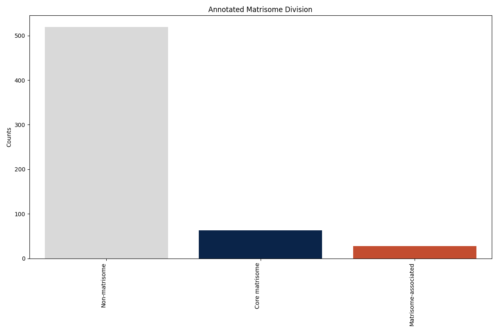
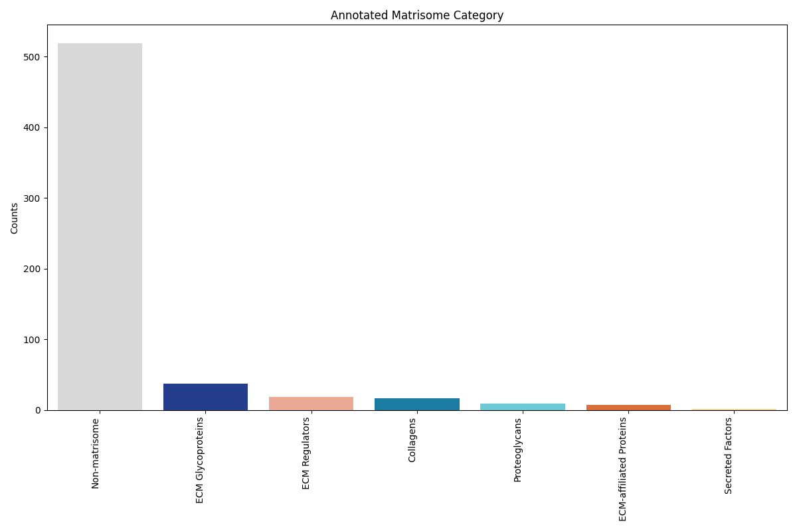
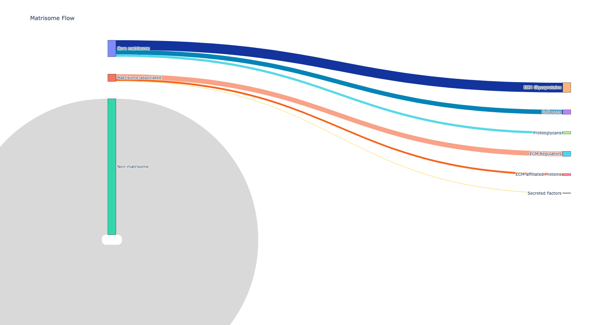
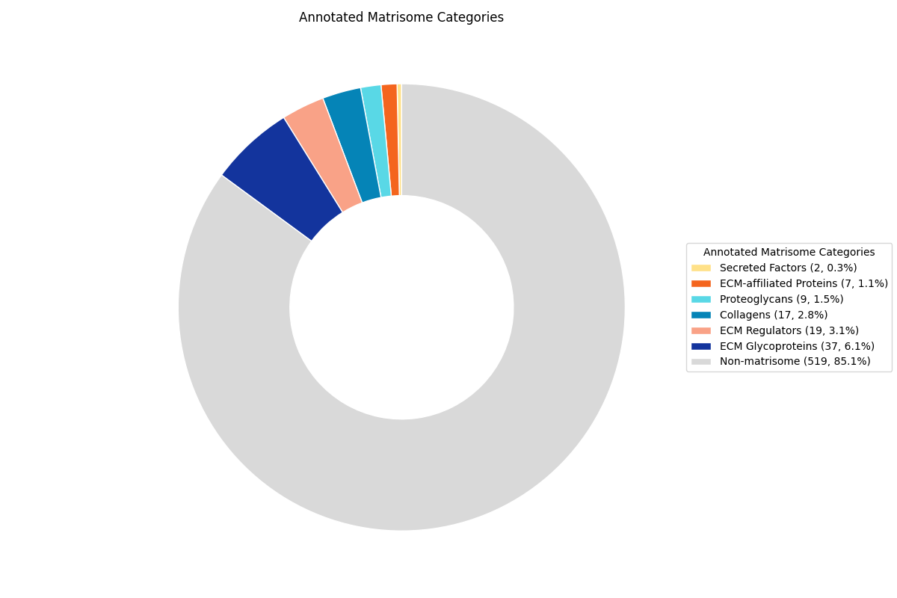

# MatrisomeAnalyzePy
If you use the MatrisomeAnalyzeR package, please cite: [Matrisome AnalyzeR: A suite of tools to annotate and quantify ECM molecules in big datasets across organisms](https://doi.org/10.1242/jcs.261255). Users can also refer to the Matrisome Project website to retrieve up-to-date lists of the matrisomes of different model organisms: https://matrisome.org. 

* Authors and maintainers: IzziLab (✉️ <valerio.izzi@oulu.fi>) and Naba Lab (✉️ <anaba@uic.edu>)
* This work was supported by the following grants (green: Naba lab; blue: Izzi lab):

### Example 1: Mass spectrometry data
|                  matribar                   |                  matriflow                  |                  matriring                  |                  matristar                  |
|:-------------------------------------------:|:-------------------------------------------:|:-------------------------------------------:|:-------------------------------------------:|
|  |  |  |  |
